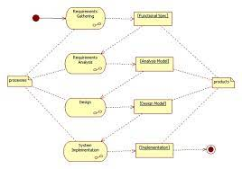
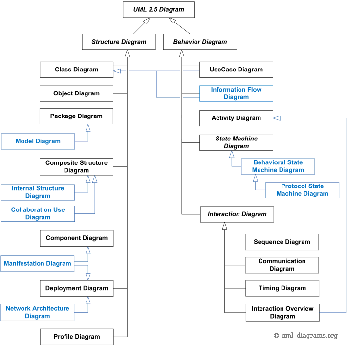
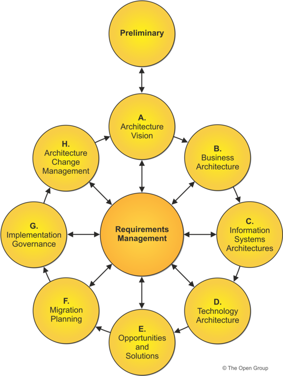
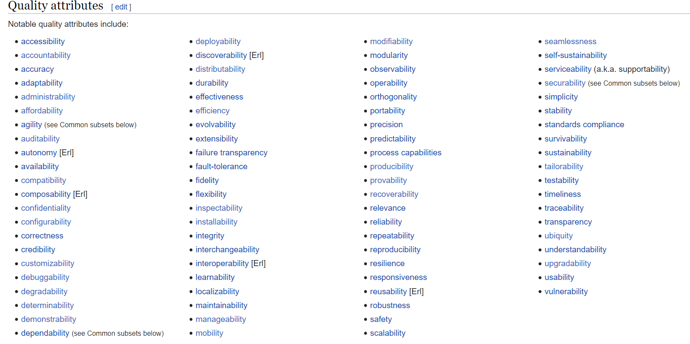
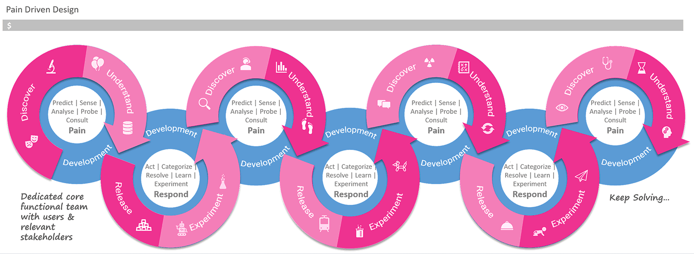
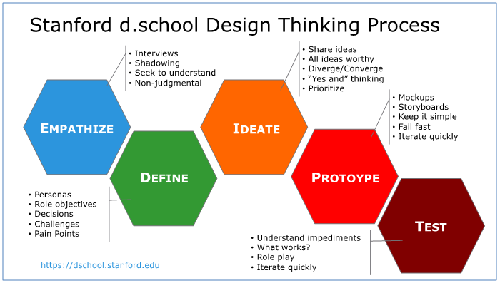

# Requirements Knockdown for Technical Architects

*By Sachin Dixit*

## Identify

- Actors
- Flows or Use cases or Journeys
- Usage Scenario
- Service Expectations
- Special instructions

As defined in common man's language.

## Per OOAD Mandate

Grady Booch's book:

- System boundary
- Logical Object Model
- Physical object model
- Logical data model
- Physical data model
- Algorithmic decomposition

This has led to SRP, HCLC and other axioms. Dated but useful.

## Per UML Spec

- Ref: https://www.uml-diagrams.org/uml-25-diagrams.html

## Per TOGAF

- **Architecture Domains**
  - The *Business Architecture* defines the business strategy, governance, organization, and key business processes
  - The *Data Architecture* describes the structure of an organization's logical and physical data assets and data management resources
  - The *Application Architecture* provides a blueprint for the individual applications to be deployed, their interactions, and their relationships to the core business processes of the organization
  - The *Technology Architecture* describes the logical software and hardware capabilities that are required to support the deployment of business, data, and application services; this includes IT infrastructure
- **Architecture Development Method**
  - Phase A: Architecture Vision describes the initial phase of an architecture development cycle
  - Phase B: Business Architecture describes the development of a Business Architecture to support the agreed Architecture Vision
  - Phase C: Information Systems Architectures describes the development of Information Systems Architectures to support the agreed Architecture Vision
  - Phase D: Technology Architecture describes the development of the Technology Architecture to support the agreed Architecture Vision
  - Phase E: Opportunities & Solutions conducts initial implementation planning and the identification of delivery vehicles for the architecture defined in the previous phases
  - Phase F: Migration Planning addresses how to move from the Baseline to the Target Architectures by finalizing a detailed Implementation and Migration Plan
  - Phase G: Implementation Governance provides an architectural oversight of the implementation
  - Phase H: Architecture Change Management establishes procedures for managing change to the new architecture
  - Requirements Management examines the process of managing architecture requirements throughout the ADM
- https://pubs.opengroup.org/architecture/togaf9-doc/arch/index.html

## Quality of Service for Software Systems

- https://en.wikipedia.org/wiki/List_of_system_quality_attributes

## Per AWS

Main link: https://aws.amazon.com/blogs/apn/new-validation-checklists-clarify-requirements-for-aws-service-delivery-program/

- [AWS CloudFormation Checklist](https://s3-us-west-2.amazonaws.com/service-delivery.awspartner.com/Checklists/AWS+Service+Delivery+Partner+Validation+Checklist_AWS+CloudFormation.pdf)
- [Amazon CloudFront Checklist](https://s3-us-west-2.amazonaws.com/service-delivery.awspartner.com/Checklists/AWS+Service+Delivery+Partner+Validation+Checklist_CloudFront.pdf)
- [Amazon EC2 for Windows Checklist](https://s3-us-west-2.amazonaws.com/service-delivery.awspartner.com/Checklists/AWS+Service+Delivery+Partner+Validation+Checklist_Amazon+EC2+Windows.pdf)
- [Amazon EMR Checklist](https://s3-us-west-2.amazonaws.com/service-delivery.awspartner.com/Checklists/AWS+Service+Delivery+Partner+Validation+Checklist_Amazon+EMR.pdf)
- [Amazon Aurora Checklist](https://s3-us-west-2.amazonaws.com/service-delivery.awspartner.com/Checklists/AWS+Service+Delivery+Partner+Validation+Checklist_Amazon+Aurora.pdf)
- [AWS Database Migration Service Checklist](https://s3-us-west-2.amazonaws.com/service-delivery.awspartner.com/Checklists/AWS+Service+Delivery+Partner+Validation+Checklist_AWS+DMS.pdf)
- [Amazon RDS Checklist](https://s3-us-west-2.amazonaws.com/service-delivery.awspartner.com/Checklists/AWS+Service+Delivery+Partner+Validation+Checklist_Amazon+RDS.pdf)
- [AWS GovCloud (US) Checklist](https://s3-us-west-2.amazonaws.com/service-delivery.awspartner.com/Checklists/AWS+Service+Delivery+Partner+Validation+Checklist_AWS+GovCloud(US).pdf)
- [Amazon Redshift Checklist](https://s3-us-west-2.amazonaws.com/service-delivery.awspartner.com/Checklists/AWS+Service+Delivery+Partner+Validation+Checklist_Amazon+Redshift.pdf)
- [AWS Server Migration Services (SMS) Checklist](https://s3-us-west-2.amazonaws.com/service-delivery.awspartner.com/Checklists/AWS+Service+Delivery+Partner+Validation+Checklist_AWS+Server+Migration+Service.pdf)
- [Amazon API Gateway Checklist](https://s3-us-west-2.amazonaws.com/service-delivery.awspartner.com/Checklists/AWS+Service+Delivery+Partner+Validation+Checklist_Amazon+API+Gateway.pdf)
- [Amazon DynamoDB Checklist](https://s3-us-west-2.amazonaws.com/service-delivery.awspartner.com/Checklists/AWS+Service+Delivery+Partner+Validation+Checklist_Amazon+DynamoDB.pdf)
- [AWS Lambda Checklist](https://s3-us-west-2.amazonaws.com/service-delivery.awspartner.com/Checklists/AWS+Service+Delivery+Partner+Validation+Checklist_AWS+Lambda.pdf)
- [AWS Service Catalog Checklist](https://s3-us-west-2.amazonaws.com/service-delivery.awspartner.com/Checklists/AWS+Service+Delivery+Partner+Validation+Checklist_AWS+Service+Catalog.pdf)
- [AWS Systems Manager Checklist](https://s3-us-west-2.amazonaws.com/service-delivery.awspartner.com/Checklists/AWS+Service+Delivery+Partner+Validation+Checklist_AWS+Systems+Manager.pdf)
- [AWS WAF Checklist](https://s3-us-west-2.amazonaws.com/service-delivery.awspartner.com/Checklists/AWS+Service+Delivery+Partner+Validation+Checklist_AWS+WAF.pdf)

## Per UX process

- No standard defined
- https://www.uxmatters.com/mt/archives/2019/06/choosing-the-right-ux-process-for-your-software-development-model.php

## Per Design Thinking

- https://web.stanford.edu/~mshanks/MichaelShanks/files/509554.pdf

## Scenario 1

Your PO wants a streaming data processing engine to be developed for your application. You will be processing high volume banking transactions in near real time during office hours. A developer should be able to go to a UI and craft these flows. We need to also allow the ability to visually code the processing flow and also support manual code where needed. As a strategic choice nodejs is the chosen technology. And we need to also support AI first as policy.

## Scenario 2

We need to create a new interactive dashboard for our banking clients. They will get a UI to see the daily state of our software that we are hosting for them. Some 30-40 types of charts might be developed.

As part of your contribution to this initiative you need to support all these metrics on a time-scale basis in the given format, to be developed using Scala as we have some reusable code already. You may use Cassandra where needed. Usage of caching is also encouraged.

## Scenario 3

You are working on a product that integrates with lots of vendor data sources and then you change something in your layer and expose that as an API to other products for consumption. Your work is to define a generic API so that anyone consuming your API can code once. Any new vendor you enable won't need new code to be released. And yes, we also need the ability to add new fields to this generic API.

And btw please also make the API REST and give a client library for consuming products to integrate fast.

## Scenario 4

Your solution uses one of the NoSQL DBs, say Mongo or Cassandra. One of your clients has asked about High Availability of this in a cloud deployment. He has his deployments in us-east and us-west. His DR site is in the Europe region. Client wants absolute guarantee that he would not suffer any data loss, which we need to assure him of.

## Scenario 5

You need to create a UI where ML engineers will do development on analytics. You are leveraging one such studio from a cloud vendor, however you need to white-label it and also provision for wrapper services like login, menu and pages for other services. Among other services are a reporting dashboard for which you leverage one of the cloud based reporting tools. There is also one ticketing system that is part of this UI ecosystem. You also use login services developed by another business unit of your organization. Your job is to provision for all needed UI components while at the same time leveraging the other products mentioned above, such that it feels like one site. You may choose Vue or Angular for this website.
